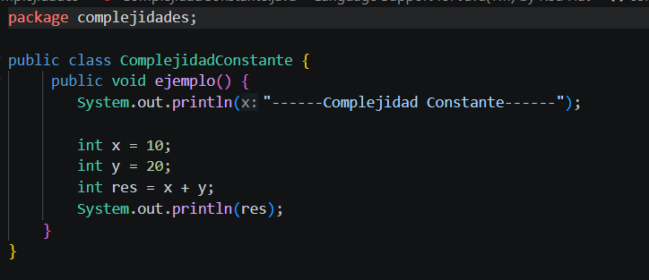
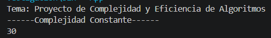
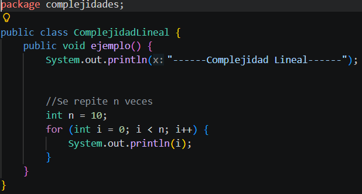
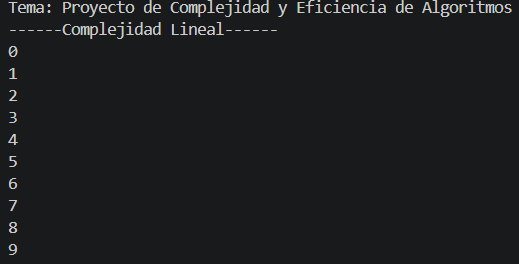
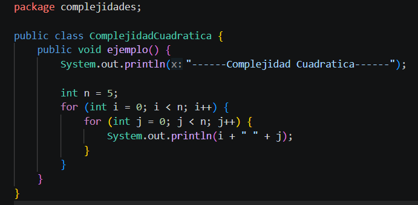
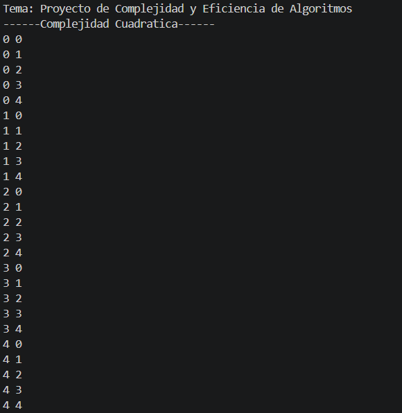
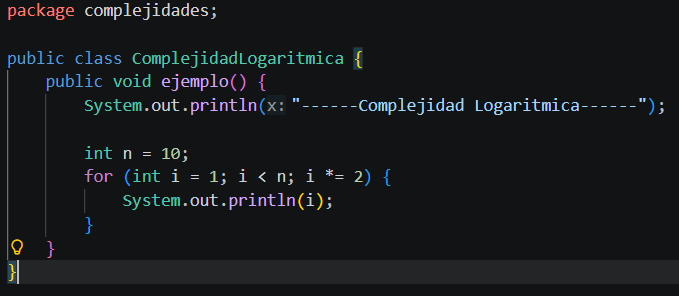
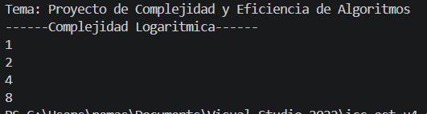
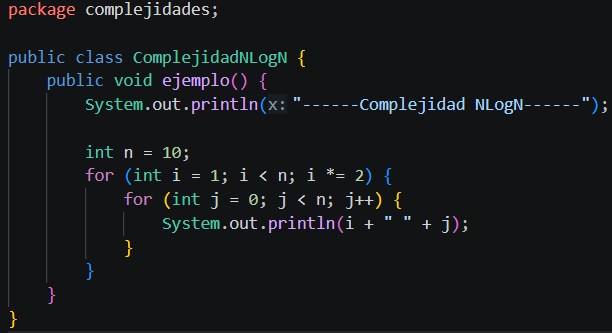
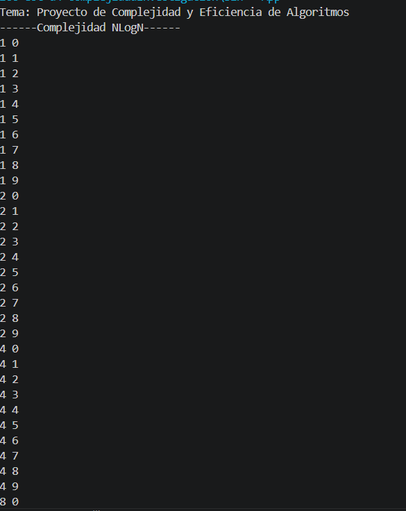

# INFORME DE INVESTIGACION

### *Asignatura:* Estructura de Datos

### *Tema:* Proyecto de Complejidad y Eficiencia de Algoritmos

# Integrantes:
- Renato Martín Amaya Siguenza - https://github.com/MartinAmaya12
- Gabriel Andrés Cuenca Orellana - https://github.com/gabriellcuenk
- Jorge Luis Padilla Mendez - https://github.com/JorgeLuisPadilla
- Sebastián Andrés Arenillas Ponce - https://github.com/Sebastian3332

# Objetivo General

El objetivo general de este proyecto es comprender y aplicar los conceptos de complejidad y eficiencia de algoritmos en Java.

# Objetivos Específicos

- Comprender las diferentes notaciones de complejidad (O(1), O(n), O(n^2), O(log n), O(n log n)).
- Implementar algoritmos con diferentes complejidades para demostrar su eficiencia.
- Analizar y explicar el rendimiento de los algoritmos implementados.

# Marco Teorico

## **1. Teoría de Complejidad**

### 1.1 Definición de Algoritmo y Eficiencia
Un algoritmo es una secuencia finita y ordenada de pasos lógicos que permiten resolver un problema específico. Se considera que un algoritmo es **eficiente** cuando no solo resuelve el problema de forma correcta, sino que lo hace optimizando el uso de recursos del sistema, principalmente minimizando el tiempo de uso del CPU y el consumo de memoria RAM.

### 1.2 La teoría de la complejidad
Es la rama de la informática que estudia la eficiencia de los algoritmos y la dificultad intrínseca de los problemas computacionales, permitiendo clasificar los algoritmos según su consumo de recursos.

### 1.3 Eficiencia de algoritmos
La eficiencia se evalúa mediante dos dimensiones principales:
1. **Coste temporal:** Se refiere al tiempo que tarda un algoritmo en ejecutarse, medido generalmente en número de operaciones elementales ejecutadas.
2. **Coste espacial:** Se refiere a la cantidad de memoria de almacenamiento (RAM) que el algoritmo requiere durante su ejecución.

### 1.4 Factores de tiempo de ejecución
El rendimiento real de un programa depende de varios factores:
* **Factores propios:** Relacionados directamente con el diseño del algoritmo y las estructuras de datos elegidas.
* **Factores circunstanciales:** Dependen del entorno externo, como la potencia del hardware, el compilador utilizado y la carga actual del sistema operativo.
* **Análisis teórico:** Evaluación matemática "a priori" que determina el comportamiento del algoritmo de forma independiente al hardware.
* **Análisis experimental:** Medición "a posteriori" realizando pruebas reales de tiempo con diferentes tamaños de entrada.

### 1.5 Notación de Complejidad (Notación Asintótica)
Se utiliza para describir el crecimiento del tiempo de ejecución cuando el tamaño de la entrada ($n$) tiende al infinito:
* **Big O ($O$):** Representa el **peor caso** o la cota superior. Es el tiempo máximo que el algoritmo tardará.
* **Omega ($\Omega$):** Representa el **mejor caso** o la cota inferior. Es el tiempo mínimo que el algoritmo requiere.
* **Theta ($\Theta$):** Representa el **caso promedio** o una cota ajustada, donde el límite superior e inferior coinciden.

### 1.6 Ejemplo de Analogía
Para entender la eficiencia, imaginemos buscar un nombre en una guía telefónica:
* Un enfoque **Lineal ($O(n)$)** sería leer página por página desde el inicio hasta encontrar el nombre.
* Un enfoque **Logarítmico ($O(\log n)$)** sería abrir la guía por la mitad, descartar la mitad donde no está el nombre por orden alfabético, y repetir el proceso. Este segundo método es drásticamente más eficiente para grandes volúmenes de datos.

## **2. Ejemplos de Complejidad en Java**

En esta sección se presentan las clases creadas dentro del proyecto y el análisis correspondiente a cada una.

---

## **2.1 Complejidad O(1) – Constante**

### **Archivo:** `ComplejidadConstante.java`

### **Código del ejemplo**

### Salida del ejemplo

### **Explicación resumida**

La complejidad es $O(1)$ (Constante) porque el número de operaciones es fijo y no depende del tamaño de ninguna entrada. El código siempre ejecuta las mismas líneas sin importar factores externos.

## **2.2 Complejidad O(n) – Lineal**

### **Archivo:** `ComplejidadLineal.java`

### **Código del ejemplo**

### Salida del ejemplo

### **Explicación resumida**

La complejidad es $O(n)$ (Lineal) porque existe un bucle que itera exactamente $n$ veces. El tiempo de ejecución crece proporcionalmente al tamaño de $n$; si $n$ se duplica, el tiempo también2.

## **2.3 Complejidad O(n^2) – Cuadrática**

### **Archivo:** `ComplejidadCuadratica.java`

### **Código del ejemplo**

### Salida del ejemplo

### **Explicación resumida**

La complejidad es $O(n^2)$ (Cuadrática) debido a la presencia de dos bucles anidados. Por cada iteración del bucle externo, el interno se ejecuta completamente, resultando en $n \times n$ operaciones totales

## **2.4 Complejidad O(log n) – Logaritmica**

### **Archivo:** `ComplejidadLogaritmica.java`

### **Código del ejemplo**

### Salida del ejemplo

### **Explicación resumida**

La complejidad es $O(\log n)$ (Logarítmica). En lugar de recorrer todos los elementos, el algoritmo salta pasos multiplicando el iterador (o dividiendo el problema), lo que reduce drásticamente el número de operaciones necesarias.

## **2.5 Complejidad O(n log n) – Logaritmica**

### **Archivo:** `ComplejidadNLogN.java`

### **Código del ejemplo**

### Salida del ejemplo

### **Explicación resumida**

La complejidad es $O(n \log n)$. Se produce al combinar un bucle logarítmico (externo) con un bucle lineal (interno). Es común en algoritmos de ordenamiento eficientes como Merge Sort o Quick Sort.

# **Conclusiones**

**Martin Amaya**:
Y como conclusion, adicional a lo que se investigo y averiguo sobre este tema, nos hizo destacar fue al implementar las clases fue visaulizar la potencia de la complejidad
Logaritmica  ($O(\log n)$)5. Resulta sorprendente ver como una pequena modificacion en la estructura del bucle. Esto permite al algoritmo evitar pasos y procesar datos masivos en una
cantidad de tiempo mmucho mas inferior a la de un enfoque lineal.
Por otra parte, se aprendio de la parte teorica que la programacion eficiente va mas alla de que un simple codigo compile sin errores. Se comprendio la importancia de realizar un analisis
utilizando la notacion Big O.Se permite predecir si el software sera escalable y soportara una carga real de usuarios antes de invertir tiempo en su desarrllo final.
Por ultimo, se avisto que la complejidad cuadratica ($O(n^2)$), se podria decir que es la menos eficiente de las anteriormente revisadas. Esto se debe a que tiene un ciclo dentro de otro.
Esto provoca que el trabajo se multiplique drasticamente. Si se duplica la cantidad de datos, el tiempo de espera incrementa exponencialmente. Esto da a entender que no es una solucion viable
para el manejo de grandes volumenes de informacion.

**Gabriel Cuenca**:
Con este proyecto pude entender en la práctica que no todos los algoritmos se comportan igual cuando los datos crecen. Lo que más me sorprendió fue darme cuenta de que dos ciclos anidados no siempre significan O(n2), como lo demostró la complejidad logaritmica, donde un simple i *= 2 cambia completamente el comportamiento del algoritmo. Ese detalle me enseñó que no basta con que el programa funcione sino que hay que entender cómo está escrito y por qué. Me llevo la idea de que elegir bien el algoritmo desde el principio marca una diferencia real.

**Sebastian Arenillas**:
En este proyecto entendí que la complejidad de los algoritmos es clave para evaluar qué tan eficiente es un programa, especialmente cuando se trabaja con grandes cantidades de datos. Aprendí que pequeñas diferencias en la forma de implementar un algoritmo pueden generar grandes cambios en el rendimiento, por lo que no basta con que el código funcione, sino que también debe ser optimizado. Esto me ayudó a tomar mayor conciencia sobre la importancia de elegir buenas soluciones desde el inicio para evitar problemas de rendimiento en el futuro.
